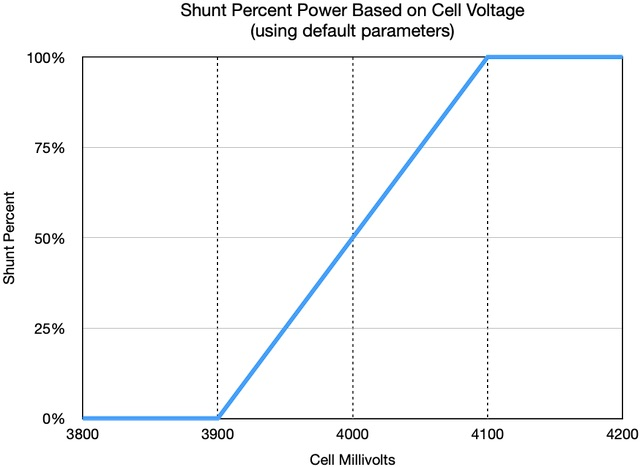
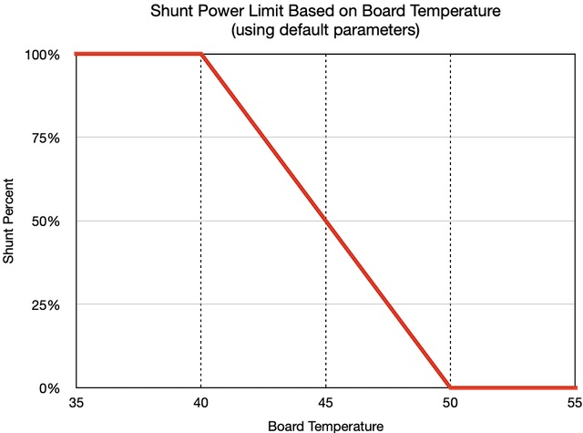

BMSNode Command Specification
=============================

This document specifies the BMSNode commands and responses. For details about
the packet format, see the [Packet Specification](packet).

All commands are sent with the packet "reply" bit clear, and all responses have
the reply bit set.

PING (1)
--------

### Command

|Byte   |Usage |
|-------|------|
|CMD    | 1    |
|LEN    | 0    |
|PLD    | None |

### Response

With reply bit:

|Byte   |Usage |
|-------|------|
|CMD    | 1    |
|LEN    | 0    |
|PLD    | None |

### Description

The PING command is used for aliveness and device discovery. It replies with
the same command code to indicate presence on the bus. It also turns on the
green LED for 1 second for visual identification.

DFU (2)
-------

### Command

|Byte   |Usage |
|-------|------|
|CMD    | 2    |
|LEN    | 0    |
|PLD    | None |

### Response

The DFU command does not have a reply.

### Description

Upon receiving this command the node enters DFU mode (boot loader running).
At this point it is awaiting boot loader commands. If no boot loader commands
are received within a timeout period (4 seconds at the time of this writing),
the the firmware restarts.

The boot loader is (mostly) Arduino compatible
[Optiboot](https://gitlab.com/kroesche/bmsnode/-/blob/master/build/optiboot/README.md).
However, it has been modified to work using serial half-duplex. This
modification is needed for the boot loader to work with the BMS Node serial
hardware. Because of this, the normal tool for boot loading,
[avrdude](https://www.nongnu.org/avrdude/), is not compatible. A python tool
called `bmsloader.py` is provided in the utilities directory.

UID (3)
-------

### Command

|Byte   |Usage |
|-------|------|
|CMD    | 3    |
|LEN    | 0    |
|PLD    | None |

### Response

With reply bit:

|Byte    |Usage                      |
|--------|---------------------------|
|CMD     | 3                         |
|LEN     | 8                         |
|PLD[0:3]| 32-bit UID, little-endian |
|PLD[4]  | board type                |
|PLD[5]  | firmware major version    |
|PLD[6]  | firmware minor version    |
|PLD[7]  | firmware patch version    |

### Description

The UID command is used to discover the unique ID (UID) for a board. It also
returns the board type and the firmware version.

**Board Types**

|Type|Description                                           |
|----|------------------------------------------------------|
| 1  |OSHPark v4 first prototype boards                     |
| 2  |Stuart v4.2 small batch proto (w/incorrect thermistor)|
| 3  |BMSNode v1 redesign prototypes                        |
| 4  |BMSNode v1 small production lot from JLCPCB           |
| 5  |BMSNode v2                                            |

**NOTE:** A BMSNode will accept and respond to this command at address 0, if
the BMSNode does not have already assigned a bus address. This command can be
used to discover the UID of a fresh device that has never had a bus address
assigned. If there is more than one device on the bus that meets this criteria,
then the likely results will be garbled packets.

The expected usage is to attach a fresh device to a bus, use this command to
find the UID, then use the UID to set a new bus address using the ADDR command.

ADDR (4)
--------

### Command

|Byte    |Usage                      |
|--------|---------------------------|
|CMD     | 4                         |
|LEN     | 4                         |
|PLD[0:3]| 32-bit UID, little-endian |

### Response

With reply bit:

|Byte    |Usage                      |
|--------|---------------------------|
|CMD     | 4                         |
|LEN     | 4                         |
|PLD[0:3]| 32-bit UID, little-endian |

### Description

The ADDR command is used to set the bus address for a BMSNode. This command is
unlike other commands in that it uses the UID to match the node, and the
packet address field to specify the new bus address.

When a node receives a ADDR packet, it checks its own UID to match the packet.
If the UID does not match, *the node does not respond, even if it already has
a matching bus address*. This means that it is possible to assign the same bus
address to different nodes on the same bus. This behavior makes it possible for
a controller to assign bus addresses to all devices on a bus without regard
to any already-assigned bus addresses. To do this, the controller must know
the UID of all devices on the bus.

ADCRAW (5)
----------

### Version Notes

|Version|Notes                          |
|-------|-------------------------------|
| `0.5` |command introduced             |
| `0.11`|added MCU temperature raw data |

### Command

|Byte   |Usage |
|-------|------|
|CMD    | 5    |
|LEN    | 0    |
|PLD    | None |

### Response

With reply bit:

|Byte    |Usage                         |
|--------|------------------------------|
|CMD     | 5                            |
|LEN     | 8                            |
|PLD[1:0]| Cell voltage sample data     |
|PLD[3:2]| Onboard thermistor sample    |
|PLD[5:4]| External sensor sample       |
|PLD[7:6]| MCU temperature sample       |

### Description

The ADCRAW command is used to retrieve the raw sample data from the ADC module.
The data is 10-bit unsigned, stored in two 8-bit values. The data is little-
endian. For example PLD[0] is the lower byte and PLD[1] is the upper byte of
the cell voltage sample.

### Notes

The length of this response packet could increase in the future if more analog
samples are collected. However, it should remain backwards-compatible.

STATUS (6)
----------

### Version Notes

|Version|Notes                                                      |
|-------|-----------------------------------------------------------|
| `0.5` |command introduced                                         |
| `0.6` |added shunt flag and fault                                 |
| `0.7` |replaced shunt flag and fault with single shunt status byte|
| `0.10`|added shunt PWM data item to reply packet                  |
| `0.11`|added external and internal (MCU) temperatures             |

### Command

|Byte   |Usage |
|-------|------|
|CMD    | 6    |
|LEN    | 0    |
|PLD    | None |

### Response

With reply bit:

|Byte    |Usage                                             |
|--------|--------------------------------------------------|
|CMD     | 6                                                |
|LEN     | 10                                               |
|PLD[1:0]| Cell voltage millivolts, little-endian           |
|PLD[3:2]| Board temperature in C, signed, little-endian    |
|PLD[4]  | Shunt status                                     |
|PLD[5]  | Shunt PWM value (0-255)                          |
|PLD[7:6]| External temperature in C, signed, little-endian |
|PLD[9:8]| Internal temperature in C, signed, little-endian |

### Description

The STATUS command is used to retrieve operating data from the BMS Node.
This command is WIP and subject to change.

The shunt status field shows the current status of the shunt process.

|Shunt Status|Reason                                            |
|------------|--------------------------------------------------|
| 0          |OFF - turned off                                  |
| 1          |IDLE - enabled but not shunting                   |
| 2          |ON - shunt resistors turned on                    |
| 3          |UNUSED - (old UNDERVOLT no longer used)           |
| 4          |LIMIT - PWM limited due to temperature            |

The shunt PWM field is the duty cycle of the PWM, out of 255. For example, a
value of 128 means 50% duty cycle.

SHUNTON (7)
-----------

### Version Notes

|Version|Notes                                  |
|-------|---------------------------------------|
| `0.6` |command introduced                     |
| `0.10`|behavior changed, description updated  |

### Command

|Byte   |Usage |
|-------|------|
|CMD    | 7    |
|LEN    | 0    |
|PLD    | None |

### Response

With reply bit:

|Byte   |Usage |
|-------|------|
|CMD    | 7    |
|LEN    | 0    |
|PLD    | None |

### Description

Turns on the BMS Node cell shunting mode (balancing mode). The BMS Node will
turn on the shunt resistor to drain energy from the cell, as a percentage
according to a simple linear algorithm.

When the cell voltage is below the `SHUNTMIN` parameter value, the shunt power
is fully off (0%).

When the cell voltage is above the `SHUNTMAX` parameter value, the shunt power
is fully on (100%).

When the cell voltage is between these values, the shunt power is a percentage
based on range. For example, when the cell voltage is halfway between the
lower and upper values, the shunt power will be 50%.

No matter the power level setting determined by the voltage, the actual power
may be limited by temperature as described below. The temperature limit always
takes precendence over the value determined by voltage.

The shunt power is limited by temperature determined by the `TEMPLO` and
`TEMPHI` parameters. When the temperature is below `TEMPLO`, there is no
temperature shunt power limit. When the temperature is above `TEMPHI` the
shunt power is limited to be fully off (0%).

When the temperature is between `TEMPLO` and `TEMPHI`, the shunt power is
limited according to the temperature range. For example, if the temperature is
halfway between the lower and upper temperature limits, then the total shunt
power is limited to 50% regardless of the power level determined by the cell
voltage.

SHUNTOFF (8)
------------

### Version Notes

|Version|Notes                      |
|-------|---------------------------|
| `0.6` |command introduced         |

### Command

|Byte   |Usage |
|-------|------|
|CMD    | 8    |
|LEN    | 0    |
|PLD    | None |

### Response

With reply bit:

|Byte   |Usage |
|-------|------|
|CMD    | 8    |
|LEN    | 0    |
|PLD    | None |

### Description

Turns off the BMS Node cell shunting mode (balancing mode).

SETPARM (9)
-----------

### Version Notes

|Version|Notes                                                              |
|-------|-------------------------------------------------------------------|
| `0.7` |command introduced                                                 |
| `0.10`|changes to SHUNTMAX, SHUNTMIN, TEMPLO, TEMPHI, deprecated SHUNTTIME|

### Command

|Byte   |Usage                              |
|-------|-----------------------------------|
|CMD    | 9                                 |
|LEN    | 2+ (at least 2 bytes)             |
|PLD[0] | parameter ID                      |
|PLD[1] | first byte of parameter value     |
|PLD[N] | additional bytes of parm value    |

### Response

With reply bit:

|Byte   |Usage          |
|-------|---------------|
|CMD    | 9             |
|LEN    | 1             |
|PLD[0] | parameter ID  |

### Description

Sets the value of a configuration parameter. The parameter ID is specified as
the first byte of the payload, and following bytes represent the parameter
value. The meaning of the bytes depend on which parameter is selected.

The following table summarizes the configuration parameters. See the following
sections for details. Items marker TBD are placeholders and not yet
implemented.

|ID |Name     |Len|Default|Description                                       |
|---|---------|---|-------|--------------------------------------------------|
| 1 |ADDR     | 1 | None  |node address (read-only)                          |
| 2 |VSCALE   | 2 | 4400  |cell voltage calibration scaler                   |
| 3 |VOFFSET  | 2 |   0   |cell voltage calibration offset                   |
| 4 |TSCALE   | 2 |   0   |(TBD) temp sensor calibration scaler              |
| 5 |TOFFSET  | 2 |   0   |(TBD) temp sensor calibration offset              |
| 6 |XSCALE   | 2 |   0   |(TBD) external sensor calibration scaler          |
| 7 |XOFFSET  | 2 |   0   |(TBD) external sensor calibration offset          |
| 8 |SHUNTMAX | 2 | 4100  |voltage above which shunting is fully on          |
| 9 |SHUNTMIN | 2 | 3900  |voltage below which shunting is full off          |
|10 |unused   | 2 |   -   |deprecated shunt inactivity timeout               |
|11 |TEMPHI   | 1 |  50   |upper limit for temperature regulation            |
|12 |TEMPLO   | 1 |  40   |lower limit for temperature regulation            |
|13 |TEMPADJ  | 2 |   0   |(TBD)temperature regulation adjustment factor     |

#### Parameter ADDR

|Name     |Len|PLD[0]            |
|---------|---|------------------|
|ADDR     | 1 |8-bit node address| 

##### Notes

This parameter should be read-only, but this is not enforced by firmware.
Therefore, the controller can set the board address using SETPARM with this
parameter. However, the reply packet will have the new address which will
appear to be an error or non-response from the board.

**SETPARM should not be used to set the address parameter.** Use the `ADDR`
command instead.

#### Parameter VSCALE

|Name     |Len|PLD[0]   |PLD[1]   |
|---------|---|---------|---------|
|VSCALE   | 2 |low byte |high byte|

##### Default Value

`4400`

##### Notes

This parameter is a 16-bit unsigned calibration scaler applied when
calculating the cell voltage.

This parameter is multipled by the cell voltage ADC value to convert the ADC
value to millivolts. For purposes of fixed point math, this value is multiplied
by 1024 prior to the conversion, and then divided by 1024 later.

This parameter provides linear scaling. It is used along with `VOFFSET` to get
the final converted millivolts value.

The formula below shows how to get cell millivolts from the ADC value and
includes using the VSCALE and VOFFSET parameters.

    Cell mV = ((ADC * VSCALE) / 1024) + VOFFSET

#### Parameter VOFFSET

|Name     |Len|PLD[0]   |PLD[1]   |
|---------|---|---------|---------|
|VOFFSET  | 2 |low byte |high byte|

##### Default Value

`0 mV`

##### Notes

This parameter is a 16-bit signed calibration offset, in millivolts, applied
when calculating the cell voltage.

See the `VSCALE` parameter for a description of the conversion formula.

#### Parameter TSCALE

**TBD**

#### Parameter TOFFSET

**TBD**

#### Parameter XSCALE

**TBD**

#### Parameter XOFFSET

**TBD**

#### Parameter SHUNTMAX

|Name     |Len|PLD[0]   |PLD[1]   |
|---------|---|---------|---------|
|SHUNTMAX | 2 |low byte |high byte|

##### Version Notes

|Version|Notes                              |
|-------|-----------------------------------|
| `0.10`|changed from SHUNTON to SHUNTMAX   |

##### Default Value

`4100 mV`

##### Notes

This parameter is 16-bit unsigned millivolts and is the upper end of the
voltage range defined by `SHUNTMIN` and `SHUNTMAX`. This range is used to
determine the shunt power percentage. When the cell voltage is above this
limit, the shunt power is fully on (100% duty cycle).

This value must always be greater that `SHUNTMIN`.

#### Parameter SHUNTMIN

|Name     |Len|PLD[0]   |PLD[1]   |
|---------|---|---------|---------|
|SHUNTMIN | 2 |low byte |high byte|

##### Version Notes

|Version|Notes                              |
|-------|-----------------------------------|
| `0.10`|changed from SHUNTOFF to SHUNTMIN  |

##### Default Value

`3900 mV`

##### Notes

This parameter is 16-bit unsigned millivolts and is the lower end of the
voltage range defined by `SHUNTMIN` and `SHUNTMAX`. This range is used to
determine the shunt power percentage. When the cell voltage is below this
limit, the shunt power is fully off (0% duty cycle).

#### Parameter (deprecated) SHUNTTIME

|Name     |Len|PLD[0]   |PLD[1]   |
|---------|---|---------|---------|
|SHUNTTIME| 2 |low byte |high byte|

##### Version Notes

|Version|Notes                              |
|-------|-----------------------------------|
| `0.10`|deprecated from use                |

##### Default Value

N/A

##### Notes

This was previously used to set a shunt idle timeout. It is no longer used.
The shunt idle timeout is permanently fixed at 30 seconds.

#### Parameter TEMPHI

|Name     |Len|PLD[0]                        |
|---------|---|------------------------------|
|TEMPHI   | 1 |8-bit signed temperature limit|

##### Version Notes

|Version|Notes                                                          |
|-------|---------------------------------------------------------------|
| `0.10`|description updated to describe shunt power temperature limit  |

##### Default Value

`50 C`

##### Notes

This parameter is an 8-bit signed temperature value, in C. This parameter works
with `TEMPLO` to define a temperature range use to limit shunt power. When the
temperature is above this value, shunt power is limited to fully off.

#### Parameter TEMPLO

|Name     |Len|PLD[0]                        |
|---------|---|------------------------------|
|TEMPLO   | 1 |8-bit signed temperature limit|

##### Version Notes

|Version|Notes                                                          |
|-------|---------------------------------------------------------------|
| `0.10`|description updated to describe shunt power temperature limit  |

##### Default Value

`40 C`

##### Notes

This parameter is an 8-bit signed temperature value, in C. This parameter works
with `TEMPHI` to define a temperature range use to limit shunt power. When the
temperature is below this value, shunt power is not temperature limited.

#### Parameter TEMPADJ

TBD

GETPARM (10)
-----------

### Version Notes

|Version|Notes                      |
|-------|---------------------------|
| `0.7` |command introduced         |

### Command

|Byte   |Usage                              |
|-------|-----------------------------------|
|CMD    | 10                                |
|LEN    | 1                                 |
|PLD[0] | parameter ID                      |

### Response

With reply bit:

|Byte   |Usage                              |
|-------|-----------------------------------|
|CMD    | 10                                |
|LEN    | 2+ (at least 2 bytes)             |
|PLD[0] | parameter ID                      |
|PLD[1] | first byte of parameter value     |
|PLD[N] | additional bytes of parm value    |

### Description

Gets the value of a configuration parameter. The parameter ID is specified as
the first byte of the payload. In the reply, the first byte of the payload is
the parameter ID, and the following payload bytes represent the parameter
value. The meaning of the bytes depend on which parameter is selected.

See the *SETPARM* command for detailed descriptions of the parameters.

TESTMODE (11)
------------

### Version Notes

|Version|Notes                          |
|-------|-------------------------------|
| `0.9` |command introduced             |
| `0.10`|added value fields to command  |

### Command

|Byte   |Usage                              |
|-------|-----------------------------------|
|CMD    | 11                                |
|LEN    | 5                                 |
|PLD[0] | test function                     |
|PLD[1] | test key 1                        |
|PLD[2] | test key 2                        |
|PLD[3] | test value 0                      |
|PLD[4] | test value 1                      |

### Response

With reply bit:

|Byte   |Usage |
|-------|------|
|CMD    | 11   |
|LEN    | 0    |
|PLD    | None |

### Description

Places the BMSNode into one of several test modes. The first byte of the
payload is the test function code. The next two bytes are a fixed key value
that must be passed in the command. The value of the key bytes is:
`0xCA, 0xFE`.

The next two bytes are values that are used depending on the test mode. As of
`0.10` only test value 0 is used for the shunt test mode.

A single function code is used to turn off any active test mode and the key
does not have to match. For all remaining test function codes, the key must
match. If the test function is not turned off by command, it will be
automatically turned off after 60 seconds.

Only one test function can be active at a time. While a test function is
active, the device does not sleep (does not go to low power). While a test
function is active, other commands do not work. (TODO: Verify this)

**Test Function Codes**

|Code| Test Function            |
|----|--------------------------|
|  0 | turn off test function   |
|  1 | turn on Vref             |
|  2 | turn on external IO      |
|  3 | turn on shunt resistor   |
|  4 | blink LEDs               |

#### Shunt Test Mode

For shunt test mode, pass in the PWM setting in test value 0. Test value 1 must
be 0. The PWM setting is out of 255. For example to set 50% PWM use a value of
128.

**WARNING:** when shunt test mode is used there is no thermal regulation. It is
meant to be used for quick testing and not for extended use. Do not repeatedly
activate shunt test mode without robust temperature monitoring.

FACTORY (12)
-----------

### Version Notes

|Version |Notes                          |
|--------|-------------------------------|
|`0.10.3`|command introduced             |

### Command

|Byte   |Usage                              |
|-------|-----------------------------------|
|CMD    | 12                                |
|LEN    | 0                                 |
|PLD    | None                              |

### Response

With reply bit:

|Byte   |Usage |
|-------|------|
|CMD    | 12   |
|LEN    | 0    |
|PLD    | None |

### Description

Resets the BMSNode configuration to the factory default values.

**WARNING:**

*This will cause the BMSNode to lose it's BUS ID. It will be reset to 0. This
means that the reply packet will have an address of 0 instead of the Bus ID
that was used for the command. This might appear to be a non-reply if the
controller is not expecting it.*

You will need to (re)assign the Bus ID after this.

All calibration parameters will be reset to defaults.
