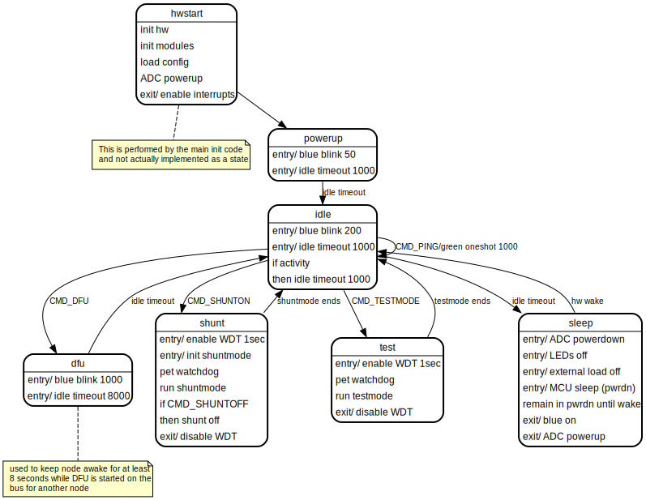

BMSNode Design Notes
====================

This is an informal design document to collect various notes about the BMSNode
firmware design.

Other Documents
---------------

* [Project requirements](requirements.md)
* [Packet Protocol Specification](packet.md)
* [Command Specification](command.md)
* [Release Process](release-process.md)

Tools and Development Environment
---------------------------------

The firmware is written in C and compiled using **avr-gcc**. Toolchain binaries
are available from
[Microchip](https://www.microchip.com/mplab/avr-support/avr-and-arm-toolchains-c-compilers)
and other places. You can also get the AVR toolchain as a plugin for
[platformio](https://platformio.org).

Makefiles are used extensively wherever automation scripting is useful. Most
non-embedded tooling is written in Python (3). Look in Makefiles first to see
how to use various automation scripts. Also look at README files for sometimes
useful information.

The development environment is assumed to be POSIX-like with normal development
tools and bash shell (other shells may work). Almost all steps are done using
command line tools.

Firmware is unit tested (in the host environment) using
[Catch2](https://github.com/catchorg/Catch2) and
[Fake Function Framework](https://github.com/meekrosoft/fff). During unit test
code coverage data is generated using the compiler built-in profiling and
reports generated using [gcovr](https://gcovr.com/en/stable/). Code quality
checking is performed using [cppcheck](http://cppcheck.sourceforge.net). See
the Makefile in the repository `./test` subdirectory for available test
operations.

[GitLab CI](https://docs.gitlab.com/ee/ci/) is used for continuous integration.
Each time the repository is pushed to GitLab, the firmware is built and all
automated tests are run, documentation is built, and preliminary release notes
and release package is generated. Tagged releases are also made using GitLab
CI and assisted by [go-semrel-gitlab](https://juhani.gitlab.io/go-semrel-gitlab/).
A purpose-built docker image is used for CI automation. See the
`./build/docker` subdirectory for details.

Execution Environment
---------------------

BMSNode firmware runs on an ATTiny1614 AVR microcontroller (as of v3 boards,
prior versions used ATTiny841).

* 10 MHz
* 16k program storage (flash)
* 2048 bytes RAM (data, heap, stack)
* 256 bytes EEPROM-like persistent storage

The firmware makes use of the following peripherals:

* UART
* hardware timer
* watchdog timer
* external voltage reference
* ADC
* GPIO

The firmware makes use of a boot loader to allow field updates of the
application. The boot loader is a variant of optiboot_x. See the subdirectory
`./build/bootloader/optiboot_x` for details. The optiboot_x boot loader uses
a little less than 512 bytes at this time and occupies the two lowest pages
in flash, in the "boot" section.

Design Overview
---------------

The firmware follow the typical embedded application pattern of using a main
loop to run the various processes and a simple state machine to track the
device functional states.

When the program starts it initializes the hardware execution environment
(hardware peripheral registers) and various module components (software init).
After that it enters a forever loop.

There are some interrupt handlers to perform some processing in interrupt
context. These are mainly the serial UART and a hardware tick timer.

At the top of the loop, several modules `_run()` function is called. These are
non-blocking calls that allow the module to perform unit(s) of processing as
non-interrupt code.

The background processes (called from the top of main loop) can generate
events such as timer timeouts, incoming commands, and sensor thresholds
(such low voltage or high temperature). Any events that are generated are then
passed to a state machine.

The rest of the main loop is implemented as a state machine with handler code
for each state.

### Low Level Processing

#### Hardware Timer

Hardware timer TCB0 is used to generate a 1 millisecond tick using an interrupt.
The interrupt handler increments a 16-bit counter, providing the ability to
count up to 65535 milliseconds. However, to implement 16-bit timer comparison
math, the maximum timeout for the 1-millisecond timer is 32767 milliseconds.
The hardware timer code is part of the `tmr` module (see below).

#### Serial Receive and Transmit

Hardware interrupts are used for receiving and transmitting serial data.
The MCU UART peripheral support half duplex in hardware and uses a shared pin.
The firmware is usually listening in receive (RX) mode. It will transmit when
there is a command requiring a response.

The receive interrupt receives any incoming bytes and passes the byte to the
packet parser (see `pkt` module). The packet parser assembles packets from the
incoming serial data.

The transmit ready interrupt is used to transmit a buffer of data (containing a
response packet). When a response is needed the response packet is assembled
into a transmit buffer, then RX is disabled and TX enabled. The TX interrupt
copies a byte at a time to the serial output until all the bytes are
transmitted.

The transmit ready interrupt occurs whenever the UART peripheral can buffer
another byte. Once a byte has been written to the UART, it takes some amount
of time for the bytes to be shifted out on the serial bus.

There is a second transmit interrupt, the TX empty which indicates all the data
has been shifted out. This interrupt is used to turn off the serial TX signal
output and re-enable the serial input. This is needed because the TX and RX
share the same signal, and when the MCU is not transmitting serial, the serial
signal must be disabled so that data can be received on the RX signal.

See the `ser` module.

### Modules

Here is a brief description of the major code modules. For more details see
the [API documentation](modules.html). Consider this a very high-level view. The
generated docs are always likely to be more up to date and more detailed.

#### ADC

[ADC Module Docs](group__adc.html)

Provides an API to perform power-up and power down of the ADC peripheral. In
order to achieve the lowest power consumption while sleeping, the peripheral
must be turned off. It also provides functions to sample all the ADC channels
and to convert the raw data into engineering units.

#### Configuration

[Configuration Module Docs](group__cfg.html)

This module manages storage of node-specific persistent data. It holds the
node bus ID and all the configuration parameters. The data is stored in a
block structure and uses a CRC to improve data integrity. If the stored data
is corrupted then a set of default parameters are used.

Functions are provided to load and store the configuration data between RAM
and EEPROM. There are also get and set functions for retrieving and modifying
specific parameters.

In normal operation, when the configuration is not being modified, the
parameters are retrieved from EEPROM, and validated, and the stored in a global
structure in RAM for direct access by the other modules.

#### Command

[Command Module Docs](group__cmd.html)

This module provides a command processor that is called from the main loop.
The processor checks for any new, complete packets that are received. If a new
packet is available, it checks for a valid command addressed to this node. If
a complete, valid command is received, it dispatches a command handler for that
command.

The remainder of this module implement handlers for each command.

#### LED

[LED Module Docs](group__led.html)

This module provides a simple abstraction for the LEDs on the board. There are
functions to turn the LEDs on or off, or to blink at a certain rate. It uses
the timer module to perform the blinking operation. There is a `_run()` function
that must be called from the main loop that manages the LED blink timers and
turns the LEDs on and off as needed.

#### List

[List Module Docs](group__list.html)

A simple linked list utility for use by other parts of the code.

#### Packet

[Packet Module Docs](group__pkt.html)

This module provides the packet parser. It is called once for each received
byte. It watches for the start of the packet and collects all the incoming
bytes in a buffer until the full packet is received. At the end if validates
the packet CRC. If a complete packet is received and validated, it becomes
available to the command processor through an API. The packet parser does not
take any action on its own. If any error is detected at any point in receiving
packet data, then the parser is reset to search for the next start of packet.

The module uses a simple (not malloc/free) buffer allocation mechanism to hold
and free the parsed packet data.

#### Serial

[Serial Module Docs](group__ser.html)

This module implements a driver for the UART peripheral. It uses interrupts to
manage receiving and sending serial data.

When data is to be transmitted a function is used to pass the data to the.
serial module. The data is copied into a small ring buffer where it is then
sent a byte at a time using the TX interrupt.

On the receive side, as data bytes are received in the RX interrupt, they are
passed to the packet parser where they are assembled into a packet. In this
case the packet module manages the buffering (there is no serial receive
buffer apart from the packet buffering in the packet module).

#### Shunt

[Shunt Module Docs](group__shunt.html)

The shunt module implement an algorithm for turning the resistive load shunt
on or off according to voltage an temperature. The shunting is turned on when
the voltage rises above a certain threshold (a configuration parameter) and
turned off when below a certain threshold. While shunting is on, the
temperature is monitored and if it goes above a temperature limit, the shunting
is modulated to keep the board from exceeding the maximum allowable
temperature.

The module provided a `_run()` function that must be called from the main loop
to keep the shunt algorithm running.

The shunt behavior can be enabled or disabled (by command).

#### Testmode

[Testmode Module Docs](group__testmode.html)

This module provides some functions to place the node into various test modes,
mainly to exercise the IO hardware on the board for test purposes.

#### Thermistor

[Thermistor Module Docs](group__therm.html)

This module provides a pre-computed lookup table for ADC count to temperature
conversion for the on-board thermistor. It is called from the ADC module to
convert the ADC to temperature in C.

#### Timer

[Timer Module Docs](group__tmr.html)

This module provides several functions to support timing needs of the BMSNode
firmware. First, it maintains an interrupt driven tick timer. This is used as
the basis for all other timing in the system.

There is a simple timer API that allows setting a timeout up to 32 seconds
in the future, and for then checking the status of the timeout.

There is a second set of functions that provides a way to set a future timer
that is added to a list maintained by the timer module. Then there is a
process function that is called by the main loop. The process function will
return an expired timer. The timer module will manage the list and add and
remove timers from the list as appropriate, and also provide for periodic or
one-shot timeouts.

#### Main

The main module provides the starting entry point for the application. It
performs the hardware initialization, and calls any necessary init functions
for the various modules.

It then sets up a forever loop that runs any non-interrupt background
processes (the `_run()` functions) and checks for events like incoming commands
or expired timers. It then runs a state machine and passes events to the
current running state.

The state machine implements a handler for each state that performs the
processing and transitions for that state.

### State Machine

The main function of the firmware is implemented as a state machine. Refer to
the diagram and state descriptios below.

#### State Transitions

|PS      |NS      |Transition                                               |
|--------|--------|---------------------------------------------------------|
|init    |powerup |unconditional                                            |
|powerup |idle    |1 seconds delay                                          |
|idle    |dfu     |DFU command                                              |
|dfu     |idle    |8 second timeout                                         |
|idle    |shunt   |SHUNT command                                            |
|shunt   |idle    |shunt mode ends (by command or timeout)                  |
|idle    |testmode|TESTMODE command                                         |
|testmode|idle    |testmode ends (by command or timeout)                    |
|idle    |sleep   |inactivity for 1 second                                  |
|sleep   |idle    |serial bus activity                                      |

#### State Descriptions

##### hwstart

Initializes the hardware and software modules, and powers up the ADC.
Enabled interrupts.

##### powerup

Blinks LED rapidly for 1 second. Allows time for init and powerup.

##### idle

This is the main state used to transition to other states. In this state, the
MCU is awake but there is no activity. In this state, certain command cause
transition to other command-specific states. If there is no serial activity for
1 second, then it will transition to the sleep state.

##### dfu

This state is used to ensure the node stays awake for an extended duration
(8 seconds) in order to give time for a DFU (boot load) opertion to begin on
the bus.

This state is a legacy of the older board design that required each node to be
a serial repeater. This state can be/should be removed.

##### shunt

This state is used to run the shunt mode process. In this mode the MCU always
stays awake. It remains in this state until the shunt mode ends either by
command, or because the shunt mode is idle for a timeout period.

##### testmode

This state is used to run a test mode (not used in normal operation). The MCU
remains awake until test mode ends.

##### sleep

This state is used to manage the MCU entyr and exit from the lowest power sleep
mode. It disables and powers down peripherals and places the hardware in a safe
configuration. It then puts the MCU into sleep mode. When the MCU is in sleep
mode, it is not executing any code and is consuming minimal power.

When there is serial activity on the bus, the MCU will exit sleep mode and the
code will resume execution. When this happens, the sleep state code will
re-power and configure the peripherals and return to the idle state.
