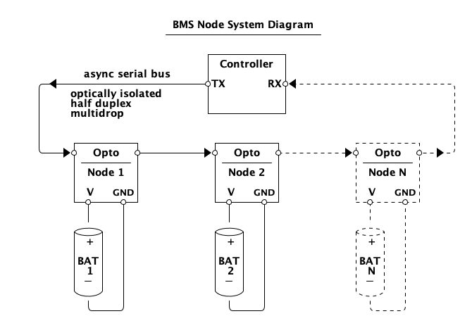

BMS Cell Node Firmware Requirements
===================================

This document provides requirements for the BMS Cell Node Firmware.

Overview
--------

The BMS Cell Node ("BMSNode") battery cell monitor node as a component of a
battery management system (BMS). A BMSNode monitors the state of a single cell,
or a set of cells in parallel, and is connected with other BMSNodes in a kind
of serial network. The BMSNode monitors the voltage and temperature, and can
also attach a shunt resistor across the cell to help with cell balancing during
charging.

System Context
--------------

The BMSNode device consist of a circuit board that is inspired by the
"diyBMSv4" project:

https://github.com/stuartpittaway/diyBMSv4

The initial BMSNode product uses prototypes from the above project. In the
future the hardware design may be updated, but that is a separate project.
For the purpose of firmware requirements, the firmware is expected to run on
this kind of circuit board.

Each node is powered by the cell it is monitoring. Each node also has a serial
transmit and receive signal loop. The TX of one node is connected to the RX
of the next node in the chain. The TX circuit uses an optocoupler to
electically isolate each node from the next.

All the nodes are connected in a chain this way. Each end of the chain is
connected back to a controller device which may be something like a Raspberry
Pi or another microcontroller.

Functional Requirements
-----------------------

### FR1 - Command and Reply Protocol

The BMSNode Firmware shall implement a serial protocol that uses a command and
response format. Each BMSNode on a serial bus has a unique address for that
bus. Each BMSNode responds to commands that match its unique bus address.

- FR.1 there shall be a serial bus protocol
- FR.2 each node on a bus shall have an address unique for that bus

### FR2 - Unique ID

The BMSNode shall have a permanent unique ID of at least 16 bits. The unique
ID shall be programmed into the device at the time of the original board
programming during production. The unique ID shall be stored in memory in such
a way that it is "permament" to the extent that is possible within the
constraints of the MCU.

The BMSNode Firmware shall have a command to report the value of the unique ID.

- FR.1 - a BMSNode shall have a unique ID of at least 16-bits. This is not
  the same as the bus address
- FR.2 - the unique ID shall be unique in the universe of BMSNodes
- FR.3 - the unique ID shall be stored in permament memory to minimize the
  likelihood it is erased. It should not be erased during a firmware update.
- FR.4 - the unique ID should be programmed into the BMSNode some time
  during production firmware load or boot loader installation

- C.1 - report unique ID

### FR3 - Configurable Parameters

The BMSNode Firmware shall maintain a set of configurable parameters that can
be updated by one or more commands, and that can be reported out in one or more
reports in response to a command. The parameters should be changeable when
commanded.  However, as much as technically possible, the parameters should
persist across a power cycle and a firmware update.

- FR.1 - there shall be a set of configurable parameters, available to
  firmware
- FR.2 - the parameters can be updated by firmware
- FR.3 - the parameters should survive a power cycle and firmware update
- FR.4 - there shall be one or more commands to update the parameters
- FR.5 - there shall be one or more commands to report the parameters

- C.1 - set parameters
- C.2 - report parameters

### FR4 - Address Provisioning

The BMSNode Firmware shall have as a parameter an 8-bit address used for
addressing in the serial bus protocol. There shall be a command by which the
BMSNode can be addressed by its Unique ID for the purpose of setting the
address.  The purpose of this command is to allow a new device that has not
been installed into a bus yet to have a new address set.

- FR.1 - there shall be an 8-bit parameter used as a serial bus address
- FR.2 - there shall be a command to set or update the value of the address
- FR.3 - the address update command shall use the unique ID for addressing
  because the bus address is no longer/not yet available

- C.1 - set bus address

- P.1 - 8-bit bus address

### FR5 - Visual Identification

The BMSNode Firmware shall have a command that causes it to flash an LED for a
certain amount of time so that a human can find it.

- FR.1 - there shall be a command to cause an LED to blink
- FR.2 - the LED shall blink at a certain rate, and for a certain amount of
  time
- FR.3 - the LED blinking shall be independent from any other function
- FR.4 - if another visual ID command is received before the prior timeout
  elapses, then the blinking should continue and the timeout reset

- C.1 - set visual ID

### FR6 - Measure and Report Voltage

The BMSNode Firmware shall measure the cell voltage and report the value if
requested by command. The voltage units are millivolts. The voltage report may
be combined with other values as part of a larger status report.

- FR.1 - the firmware shall measure the cell voltage
- FR.2 - the firmware shall convert the value to millivolts
- FR.3 - the firmware shall perform the operation at a rate of at least 1 Hz
- FR.4 - there shall be a command to report the voltage

- C.1 - report voltage

- P.1 - voltage calibration items

### FR7 - Measure and Report Temperature

The BMSNode Firmware shall measure the temperature and report the value if
requested by command. The temperature units should be in C if technically
feasible given the constraints of the device MCU, otherwise the units should be
in ADC counts. The temperature report may be combined with other values as part
of a larger status report.

- FR.1 - the firmware shall measure the temperature
- FR.2 - the firmware shall convert the value to C (if feasible)
- FR.3 - the firmware shall perform the operation at a rate of at least
  once per 5 seconds
- FR.4 - there shall be a command to report the temperature

- C.1 - report temperature

- P.1 - temperature calibration items

### FR8 - Automatic Shunting

The BMSNode Firmware has parameters related to current shunting. When the
measured cell voltage exceeds a threshold, the shunting shall be turned on. And
when the cell voltage is below a certain threshold, the shunting shall be
turned off. The implementation can make use of hysteresis and similar methods
as appropriate.  While the shunting is turned on, the temperature shall be
monitored. If the temperature rises above a threshold, the shunt signal shall
be cycled off and on as needed to prevent the temperature from exceeding a
maximum value. The implementation may use PWM or similar techniques to achieve
the requirement.  Temperature control has a higher priority than current
shunting.

- FR.1 - the firmware shall perform automatic shunting if not in manual
  shunting mode
- FR.2 - shunting shall be turned on if the cell voltage is above the
  shunt threshold parameter
- FR.3 - shunting shall be turned off if the cell voltage is below the
  shunt threshold parameter, using hysteresis if necessary
- FR.4 - if temperature is below a lower thermal regulation parameter, and
  shunting is on due to the voltage rule, then shunting shall be turned on
  at 100%
- FR.5 - if temperature is above an upper thermal regulation parameter, then
  shunting shall be turned of or set at 0% regardless of the voltage
- FR.6  - if temperature is between the lower and upper thermal regulation
  limits, and shunting is on due to the voltage rule, then the shunting
  amount should be regulated either using PWM or turned off and on using
  hysteresis.

- P.1 - shunting voltage threshold
- P.2 - lower thermal regulation limit
- P.3 - upper thermal regulation limit
- P.4 - variable shunt adjustment factor(s)

### FR6 - Commanded Shunting

The BMSNode Firmware shall have a command that turns on current shunting even
when the cell voltage does not exceed the normal threshold. Temperature
regulation shall operate the same as for Automatic Shunting. Temperature
regulation shall always take precedence over a command to turn on the shunting.
There shall be a minimum safety voltage parameter below which the shunting will
be turned off even if commanded on.

- FR.1 - there shall be a command to enter manual shunting mode
- FR.2 - upon entering manual shunting mode, automatic shunting shall be
  disabled
- FR.3 - upon leaving manual shunting mode, automatic shunting shall be enabled
- FR.4 - upon entering manual shunting mode, the current shunt shall be turned
  on
- FR.5 - manual shunting shall be subject to the same thermal regulation
  requirements as automatic shunting

- C.1 - enter manual shunting mode

### FR7 - Visual Codes

The BMSNode Firmware shall utilize the LEDs on the board in such a way that it
is possible for a human to know the state of the BMSNode (for example, shunting
or thermal regulation). This requirement is lower priority than the power
saving requirement. Therefore, the LED code scheme should not do anything that
causes excess power consumption while BMSNode is in its lowest power saving
mode.

- FR.1 - for each major functional state, there shall be a visual indication
  using LEDs. Determination of number and method of indication is left to the
  implementer.
- FR.2 - visual indicators shall not cause excessive power use, nor cause an
  increased power consumption in the lowest power mode

### FR8 - Power Saving Mode

The BMSNode Firmware shall achieve the lowest possible power consumption
possible while still performing its function. In particular, when there are no
ongoing commands or reporting, and when the voltage and temperature are below
any levels that require action, BMSNode shall consume the lowest power
technically possible while still being able to respond to commands and voltage
or temperature actions.

During shunting operation, the goal is to consume power from the battery cell.
Therefore it is permissible for the BMSNode iFirmware to operate at a high
power level while shunting is in effect, and not necessary to stay in a low
power mode.

- FR.1 - firmware design shall be such that the BMSNode is using the lowest
  amount of power practicable for the required function
- FR.2 - during the mode of lowest functionality, when no actions are required
  the firmware shall place the MCU in the lowest possible power mode
- FR.3 - during shunting operation, low power is not required

### FR9 - Diagnostic and Miscellaneous Reporting

The BMSNode Firmware will likely include additional features and internal
diagnostic information that is not covered by specific requirements. For
example perhaps there are internal counters of the number of packets received.
The BMSNode Firmware shall have one or more commands to report such
information.

- FR.1 - there shall be a command to report internal diagnostic information

- C.1 - report diagnostic info

### FR10 - In-system Firmware Update

The BMSNode Firmware shall have a method of being updated while installed
in-system as part of a chain of devices in a bus. The expected implementation
is a boot loader.  The BMSNode Firmware shall have a command to enter "update"
mode.

- FR.1 - the BMSNode firmware shall be updatable in-system, via the serial
  port
- FR.2 - there shall be a command to enter update mode
- FR.3 - update mode shall have a timeout such that if no update occurs, after
  some time normal BMSnode operation resumes

- C.1 - enter update mode

Constraints
-----------

The following are constraints that constitue non-functional requirements:

### CR1 - MCU Resources

The BMSNode Firmware shall execute within the resources of the microcontroller.
At the time of this writing, the MCU is an ATTiny841, which has the following
constraints:

* CPU clock - 8 MHz
* Flash memory - 8 kbytes (for application + boot loader)
* RAM - 512 bytes
* EEPROM - (used for parameters) 512 bytes

- CR.1 - firmware shall be designed to run with 8 MHz system clock
- CR.2 - firmware compiled size, including any boot loader and other data that
  is stored in flash, must not be larger than 8 kbytes
- CR.3 - the firmware shall not use more that 512 bytes of RAM, including
  variable, stack, and heap
- CR.4 - configurable parameters shall not be larger than 512 bytes

### CR2 - Serial bus

The BMSNode hardware is limited on the maximum serial speed to 4800, until
modifications are made to the hardware.

- CR.1 - the serial bus shall operate at a rate of 4800 bps

### CR3 - Firmware Version

The BMSNode Firmware shall include a version number that is allocated during
the build process and which is built into the firmware. The firmware version
shall be reportable by command.

- CR.1 - the firmware shall contain an embedded version
- CR.2 - the version shall be assigned at build time by the build system
- CR.3 - there shall be a command to report the firmware version

- C.1 - report firmware version

Quality and Process Requirements
--------------------------------

The following requirements are related to the development process and
quality assurance. All of these are "should" requirements at this time but
not mandatory. This sections should be viewed as desirable goals for the
project.

### QR1 - Automated build

When a commit is pushed to `origin` (such as GitLab or GitHub), a build should
run automatically and indicate if the build passed or failed.

### QR2 - Unit test

As much as possible, firmware modules should have a unit test to exercise
the module functions. A unit test report should be generated and available as
part of the automated build.

### QR3 - Coverage

As much as possible, coverage should be measured for all testing, and a report
generated and available as part of the automated build.

### QR4 - Code Quality

To the extent possible, some code quality tools should be used to evaluate the
firmware source code. As a minimum, the compiler warning level should be set
as high as practically possible and no warning allowed in production firmware.
To extend that, tools such as cppcheck should be run against the source code
and a report generated. There shall be some (low) level of acceptable issues
in production code.

### QR5 - Release Process

The BMSNode firmware should utilize a release process that builds the
production firmware, runs tests, assesses release readiness, assigns a
version number, and generates release notes. As much of this as possible should
be automated. The release process should include a release criteria which at
a minimum states the kind of testing to be performed before a release.  The
release process should be documented in a file in the project repository.

Roadmap
-------

The following is a preliminary roadmap for development and does not constitute
a requirement. The roadmap can change according to conditions during
developments, and it does not need to be udpated here.

Firmware shall be developed as a set of release milestones with each milestone
adding units of functionality. Each milestone release shall be considered a
production firmware release (even if it does not have final feature set), and
is subject to the release process and release testing.

|Milestone|Description                                              |
|---------|---------------------------------------------------------|
|   0.0   |Protocol implemented with minimal functionality. Can process commands and send a report|
|   0.1   |In-system firmware update                                |
|   0.2   |Parameters storage, unique ID and address provisioning   |
|   0.3   |Release process, firmware versioning and reporting       |
|   0.4   |Power saving mode                                        |
|   0.5   |Voltage and temperature reporting                        |
|   0.6   |Manual shunt mode                                        |
|   0.7   |Automatic shunt mode                                     |
|   0.8   |Additional features                                      |
|   0.9   |Feature refinement                                       |
|   1.0   |First production release                                 |

